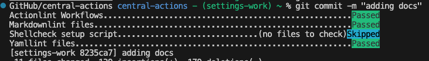

# Central Github Action Repo

An automated centralized Github Action repo that
automatically produces version controlled workflows
to use in other repos.

## Table of contents

<!--ts-->

- [Table of contents](#table-of-contents)
- [Description](#description)
- [Pre-requisites](#pre-requisites)
- [Project Dependenencies](#project-dependencies)
- [Local Mac Setup](#local-mac-setup)
- [Direnv](#direnv)
- [Using Task](#using-task)
- [Pre-commit](#pre-commit)
- [Structure](#structure)
- [Creating New Workflow](#creating-new-workflow)
- [Setting up this repo for use within your user or organization](#setting-up-this-repo-for-use-within-your-user-or-organization)
- [Repo Settings via yaml](#repo-settings-via-yaml)
- [Reviewdog](#reviewdog)
- [Calling workflows from this repo in another repo](#calling-workflows-from-this-repo-in-another-repo)

<!--te-->

## Description

This is an example of how to run a centralized
github action repo to store multiple workflows
that automatically produces version controlled
github actions via tags and releases to use in
other repos. You could then reference these
workflows either by tag or by the `main` branch
to always reference the latest one.

## Pre-requisites

This repo makes an assumption you are using a
Mac to work and make updates to it otherwise
you will need to install several packages.

## Project Dependencies

`act` [https://github.com/nektos/act](https://github.com/nektos/act)

`actionlint` [https://github.com/rhysd/actionlint](https://github.com/rhysd/actionlint)

`direnv` [https://github.com/direnv/direnv/tree/master](https://github.com/direnv/direnv/tree/master)

`go-task` [https://github.com/go-task/task](https://github.com/go-task/task)

`pre-commit` [https://github.com/pre-commit/pre-commit](https://github.com/pre-commit/pre-commit)

`markdownlint-cli2` [https://github.com/DavidAnson/markdownlint-cli2](https://github.com/DavidAnson/markdownlint-cli2)

`shfmt` [https://github.com/mvdan/sh](https://github.com/mvdan/sh)

`shellcheck` [https://github.com/koalaman/shellcheck](https://github.com/koalaman/shellcheck)

`yamllint` [https://github.com/adrienverge/yamllint](https://github.com/adrienverge/yamllint)

## Local Mac Setup

Run the script in `/scripts/setup.sh` by
doing a `./scripts/setup.sh` in your terminal.
You can refer to the `Brewfile` for a list of
dependencies it will setup.

The script will basically do the following:
`brew bundle`
`pre-commit install`
will copy the `.envrc_sample` to `.envrc`
and print out notes about using `direnv` with your specific shell

## Direnv

```"If you haven't setup direnv before, you need to add one of these to your RC file:"
'For ZSH (.zshrc): eval "$(direnv hook zsh)"'
'For BASH (.bashrc): eval "$(direnv hook bash)"'

"After adding the line, you should either restart your shell
or source the file you edited."
"source ~/.zshrc OR source ~/.bashrc"

"After that, when entering or leaving (using 'cd') the directory, you should see"
"a message from direnv about loading or unloading."
```

## Using Task

Task is modern replacement for a Makefile. You can type `task`
to get list of all the tasks you can run or refer to the `Taskfile`

```bash
task: [default] task --list
task: Available tasks for this project:
* actionlint:               Run actionlint
* all-workflows:            Generates a list of all actions
* default:                  Display available tasks
* list-workflows:           Run workflow locally
* markdownlint:             Run markdownlint
* new-workflow:             Generate a new run-workflow
* override-workflows:       Display what actions will be ran
* run-workflow:             Run workflow locally 'WORKFLOW=<workflow_name> task run-workflow'
* shellcheck:               Run shellcheck
* workflow:                 Display what workflows will be ran
* yamllint:                 Run yamllint
```

Example of how to use task:

`task list-workflows`

`WORKFLOW=test task run-workflow`

`task actionlint`

## Pre-commit



Pre commit runs task for us on git hooks which including linting.
These must pass before committing. We also run several of these checks
as part of our CI.

`pre-commit install` - this is important to install the hooks in your environment

`pre-commit run` to run the git hooks

## Structure

This repo is for holding centralized Github Action workflows
in `.github/workflows/`
The workflows that are named with a prefix of `ca_` are ones that run for this repository.

All other workflows are meant to be reusable and called from other repos

## Creating New Workflow

`task new-workflow` will then ask you for a name.
This will copy a very basic template of a workflow into
`.github/workflows/<new-workflow-name>.yml` for you to work on.

It is very important to add the `# Workflow Version: 1.0.0`
comment line to the VERY FIRST line of the workflow. This is
what drives the versioning in the repo.

## Setting up this repo for use within your user or organization

You will need to adjust some setting on the repo:

General -> Actions -> General: Enable the access section for
repositories owned by the user/org. This is important or other
repositories will not be able to access it.

You will need to create a secret called `GIT_TOKEN` for
the actions to work fully. This can be a bot PAT Token.

## Repo Settings via yaml

[https://github.com/apps/settings](https://github.com/apps/settings)

[https://docs.github.com/en/rest/reference/repos#update-a-repository](https://docs.github.com/en/rest/reference/repos#update-a-repository)

Add this app to the repo.

will read from `.github/settings.yml` to setup the repo configuration
and keep it version controlled.

Note: There is a bug around creating the branch protection.
[https://github.com/repository-settings/app/issues/625](https://github.com/repository-settings/app/issues/625)

## Reviewdog

This repo makes use of [https://github.com/reviewdog/reviewdog](https://github.com/reviewdog/reviewdog)
in it's own github action along with different linting tools to perform
in-line comments on the pull-requests.

You will need to create a secret called `REVIEWDOG_TOKEN` for
the actions to work.You can retrieve that secret after installing
the reviewdog app.

Install reviewdog Apps. <https://github.com/apps/reviewdog>
Set REVIEWDOG_TOKEN or run reviewdog CLI in trusted CI providers.
Get token from <https://reviewdog.app/gh/{owner}/{repo-name}>

## CI/CD

Upon merging in a new PR to the `main` branch this will kick off
the `wf_auto_increment` Github action. This will automatically detect
what workflows have changed based off the last commits. It will then
bump the version (patch by default) and create a new tag, and the release
of the new workflows. It can handle multple workflows updates in one
PR merge.

If you want to do major, or minor patch version updates simply add
`#major` or `#minor` to your commit message and the action will pick it up.

## Calling workflows from this repo in another repo

```yaml
name: Hadolint Check

on: [pull_request]

jobs:
  Hadolint-Check:
    uses: <org_or_username>/central_actions/.github/workflows/hadolint.yml@hadolint-<tag_name>
    with:
      dockerfile: Dockerfile
      runner: ubuntu-latest
```

## Dependabot

Is scheduled to run weekly

## TO-DO's
